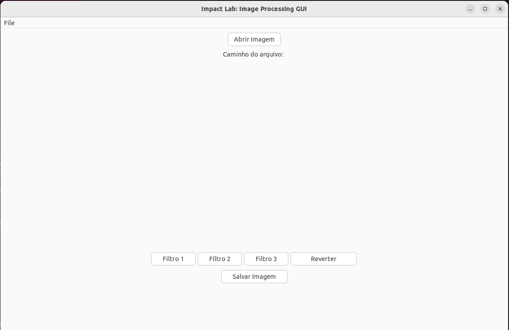
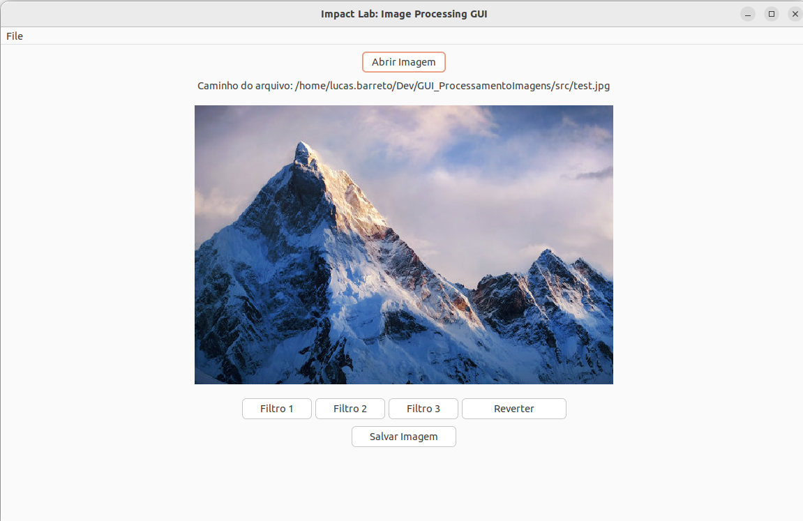
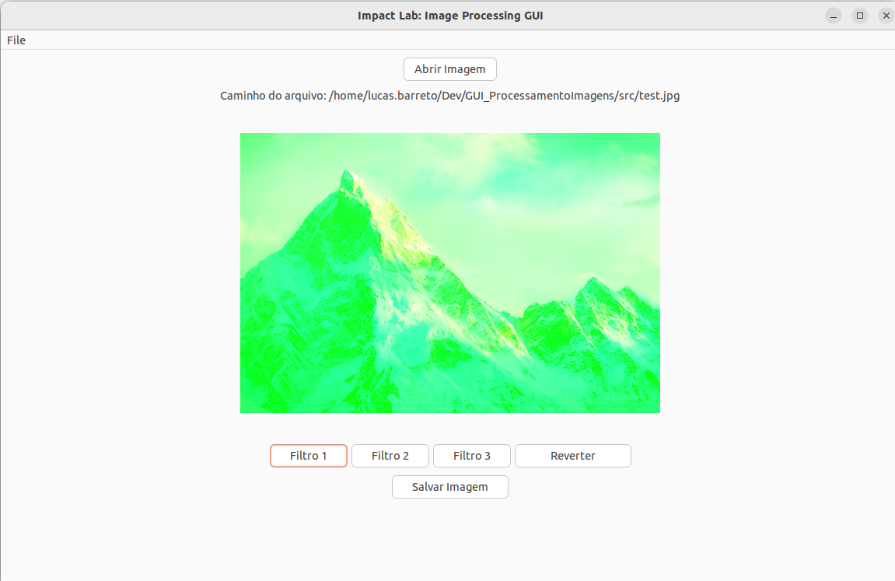
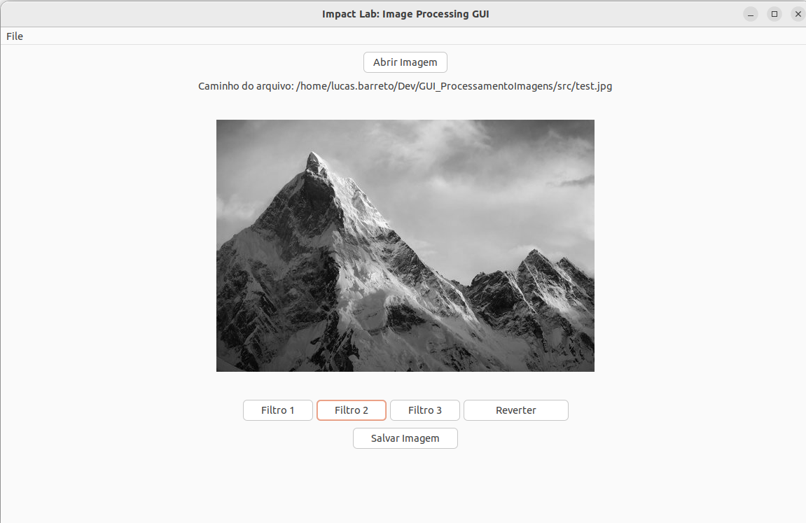
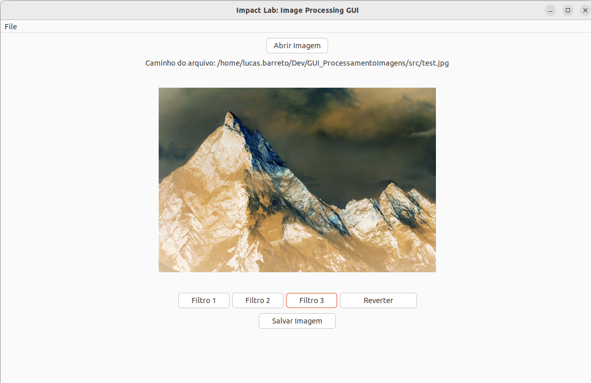
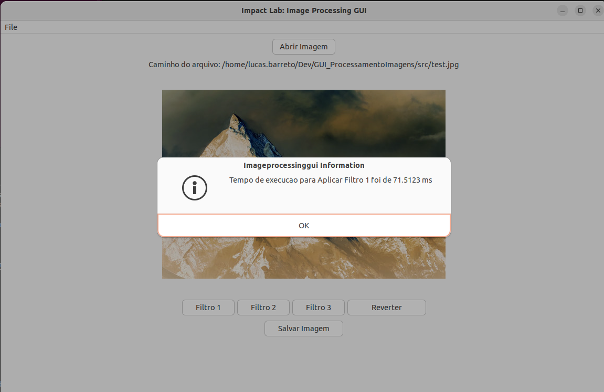

# Impact Lab - Projeto de Processamento de Imagens com GUI

Este repositório contém o projeto prático desenvolvido para o curso *Impact Lab*. O objetivo do projeto é criar uma interface gráfica (GUI) para realizar processamento de imagens utilizando a biblioteca wxWidgets em C++. A GUI permite a abertura de imagens, aplicação de filtros de imagem e medição do tempo de execução para cada operação.

## Estrutura de Diretórios

- `/src`: Contém o código-fonte do projeto.
- `/include`: Cabeçalhos e bibliotecas externas (como `stb_image.h` e `stb_image_write.h`) utilizados para carregar e manipular imagens.
- `/build`: Diretório onde os arquivos binários e executáveis são gerados após a compilação.
- `/images`: Imagens de exemplo para aplicar os filtros.
  
## Funcionalidades Principais

1. **Carregar Imagem**: A GUI permite selecionar e abrir uma imagem no formato `.jpg`, `.jpeg` ou `.png`.
2. **Filtros de Imagem**: São oferecidos três filtros de processamento de imagem:
    - **Filtro 1**: Modifica a imagem para destacar o canal verde.
    - **Filtro 2**: Filtro de escala de cinza.
    - **Filtro 3**: Filtro com as cores negativas.
3. **Salvar Imagem Filtrada**: Após a aplicação dos filtros, a imagem processada pode ser salva.
4. **Medição de Tempo de Execução**: A GUI exibe o tempo de execução para carregar a imagem, aplicar cada filtro e salvar a imagem processada.

## Como Executar o Projeto

### Requisitos

- wxWidgets
- Compilador C++ (como g++)
- CMake para compilação (se preferir)
- Bibliotecas externas (`stb_image.h` e `stb_image_write.h`)

### Passos para Compilação

1. Clone o repositório:
    ```bash
    git clone https://github.com/lucasdsbarreto/ImageProcessingGUI.git
    cd ImageProcessingGUI
    ```

2. Compile o projeto:
    ```bash
    make
    ```

3. Execute o binário gerado:
    ```bash
    ./imageProcessingGUI
    ```

## Imagens das Funcionalidades

### Tela Principal


### Tela Principal com Imagem Carregada


### Filtro 1: Destaque do Canal Verde


### Filtro 2: Escala de Cinza


### Filtro 3: Filtro Negativo


### Tempo de Execução



